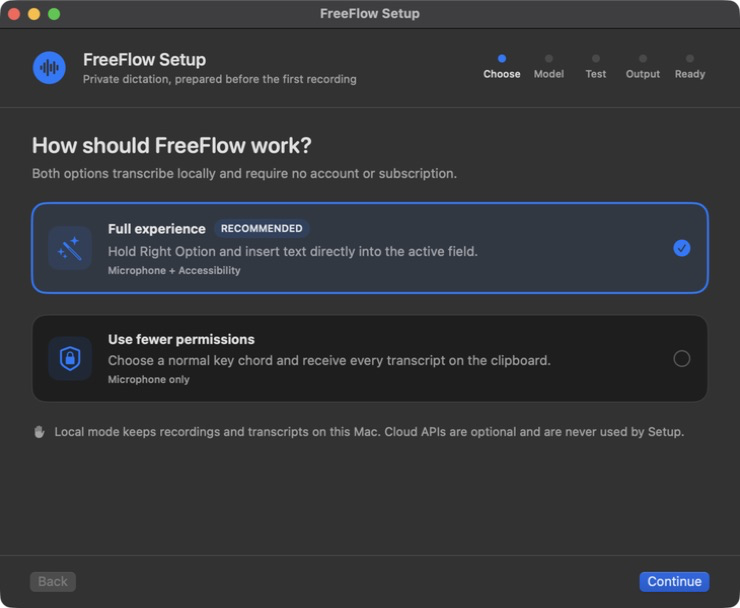
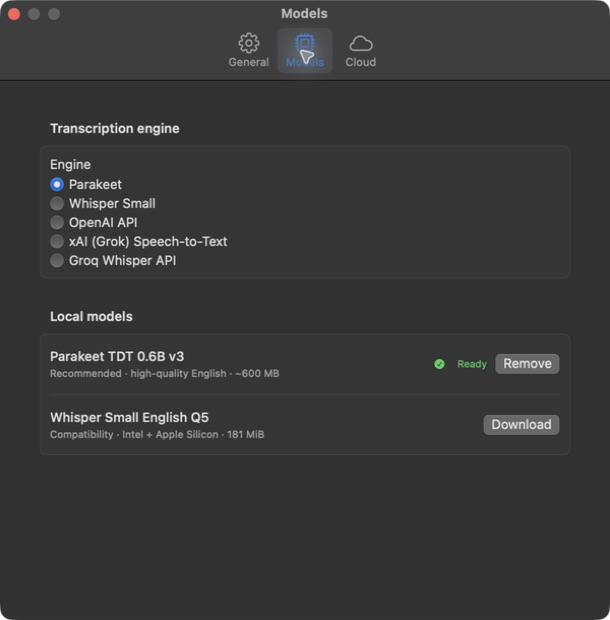

<p align="center">
  
</p>

<h1 align="center">FreeFlow</h1>

<p align="center">
  <strong>Free, open-source English dictation for macOS.</strong><br>
  Hold Right Option, speak, and release. FreeFlow puts the transcript where you were typing.
</p>

<p align="center">
  <a href="https://github.com/dsvyro1414-lab/FreeFlow/actions/workflows/ci.yml"></a>
  <a href="LICENSE"></a>
</p>

> **Make it yours.** Give this repository to Codex, Claude Code, or another AI coding agent and ask it to add a feature, change the workflow, or adapt FreeFlow to the way you work.

<p align="center">
  
</p>

## Features

- Hold Right Option to record, then release to transcribe and insert.
- Run locally with Parakeet or Whisper.
- Use OpenAI, xAI, or Groq with your own API key when you prefer cloud transcription.
- Choose direct insertion or a Microphone-only clipboard workflow.
- Recover any result with **Copy last transcript**.
- Configure everything through guided Setup and simple model settings.

FreeFlow currently supports English dictation. Local mode keeps transcription
on your Mac. Cloud mode sends each recording to the provider you choose, uses
your API key, and may incur provider charges.

## Install with Codex or Claude Code

Paste this into a coding agent with Terminal access:

```text
Install FreeFlow from https://github.com/dsvyro1414-lab/FreeFlow by following INSTALL.md. Use a fresh checkout of main and record the exact commit before building. Install only to ~/Applications/FreeFlow.app, verify the built app, launch it, and guide me through Setup.
```

## Install manually

Requires macOS 14 or newer and Swift 6 through Apple Command Line Tools or Xcode.
FreeFlow currently installs from source; there is no prebuilt download yet.

```bash
git clone https://github.com/dsvyro1414-lab/FreeFlow.git
cd FreeFlow
./script/build_and_run.sh --install
open "$HOME/Applications/FreeFlow.app"
```

Setup guides you through choosing a mode, downloading a local model, allowing the Microphone, testing transcription, and optionally enabling Accessibility for Right Option and direct insertion.

See [INSTALL.md](INSTALL.md) for detailed verification, updates, and permission recovery.

## Models

<p align="center">
  
</p>

## Status

- The current FreeFlow build has been tested on Apple Silicon with Setup, permissions, Right Option dictation, local transcription, direct insertion, OpenAI, xAI, and Groq.
- CI verifies tests, `arm64` and `x86_64` compilation, the app bundle, and source installation on macOS 14.
- Intel compiles successfully but has not been physically tested.

## Uninstall

1. Quit FreeFlow.
2. If wanted, remove downloaded models in **Settings → Models** and API keys in **Settings → Cloud**.
3. Move `~/Applications/FreeFlow.app` to Trash.
4. Remove FreeFlow from macOS Microphone and Accessibility settings if you no longer need those entries.

## License

FreeFlow is available under the [MIT License](LICENSE). It is independent from Wispr Flow and is not affiliated with Wispr AI.
